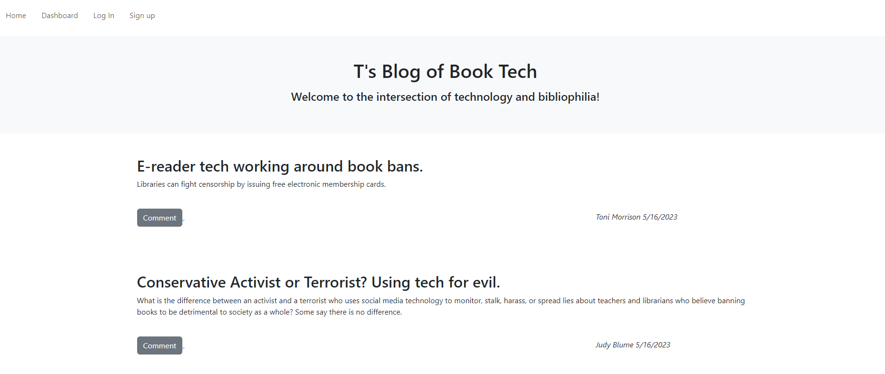

# MVC-Tech-Blog

## Description 

T's Blog of Book Tech is a website that celebrates the intersection of books and tech. When a user visits the site they will see posts that other users have made as well as comments that have been left on those posts.

A user can create an account allowing them to create, edit, and delete their own posts.

The account also allows users to comment on other posts.

---------------------------------------------------------------------------------------------------------------------------------------------

[Check out the site live here!](https://git.heroku.com/t-mvc-tech-blog.git)

-------------------------------------------------------------------------------------------------------------------------------------------------------------------------------------------

If you have found this blog outside of GitHub and wish to view the original, [visit my Repository link here.](https://github.com/tdusenbury/MVC-Tech-Blog)

-------------------------------------------------------------------------------------------------------------------------------------------------------------------------------------------

The below image shows that when the site loads, you are presented with a homepage that includes a view of posted blog content; navigation links to the homepage and dashboard; and options to signup or login to a personal account.

----------------------------------------------------------------------------------------------------------------------------------------------------------------------------------------

-------------------------------------------------------------------------------------------------------------------------------------------------------------------------------------------

## Technology Used 

|  

-------------------------------------------------------------------------------------------------------------------------------------------------------------------------------------------

## Table of Contents

  - [**Description**](#description)
  - [**Installation**](#installation)
  - [**Usage**](#usage)
  - [**Contribution**](#contributing)
  - [**Testing**](#tests)
  - [**Author Info**](#author-info)
  - [**License**](#license)

-------------------------------------------------------------------------------------------------------------------------------------------------------------------------------------------
## Usage 

Once the Slayer Sitch Tracker has been installed, the user will type 'node index-js' into the terminal command-line. A list of options is then presented to the user to view or add employees, roles, and departments. Each option will either auto-generate the requested information or ask a series of questions that, once answered, will be used to populate the corresponding chart which will then be displayed. To reset any additions back to the original list, enter 'mysql -u root -p' into the command-line, enter your login information, and then run the schema.sql and the seeds.sql.
*************
Here is the menu of initial questions to choose from:

****************
These are the questions asked to add an employee and the new table showing the new employee:

*****************
Here the role of "Accountant" has been added:

**************************************
When the role of "Armorer" is added later, you can see that "Accountant" has been retained:

-------------------------------------------------------------------------------------------------------------------------------------------------------------------------------------------

## Learning Points

I love being organized and color-coding and sorting and all the things. 

Learning how to use SQL has been a joy.

Rules, order, structure....but also a lot of thinking about how to deconstruct and then reconstruct the information to show correctly.

I look forward to learning more about SQL and its various versions to see all the many things I can do with it!

-------------------------------------------------------------------------------------------------------------------------------------------------------------------------------------------

## Author Info
My name is Tamara "T" Dusenbury
If you have any questions about me or this project, please contact me:
  
- [**Github**](https://github.com/tdusenbury)

- [**LinkedIn**](https://linkedin.com/in/tamara-dusenbury-02ab8591)

- [**Email**](mailto:tamara.dusenbury@gmail.com)

-------------------------------------------------------------------------------------------------------------------------------------------------------------------------------------------
## Credits

Shout outs to the cohort and study group!!! We made it half-way!!!!

-------------------------------------------------------------------------------------------------------------------------------------------------------------------------------------------

## Contributing

If you would like to contribute, please follow the [Contributor Covenant](https://www.contributor-covenant.org/).

-------------------------------------------------------------------------------------------------------------------------------------------------------------------------------------------

## License

This projects holds an MIT License.