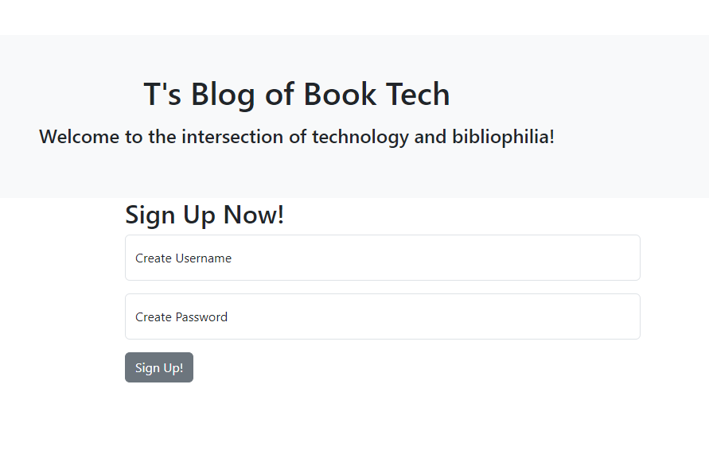
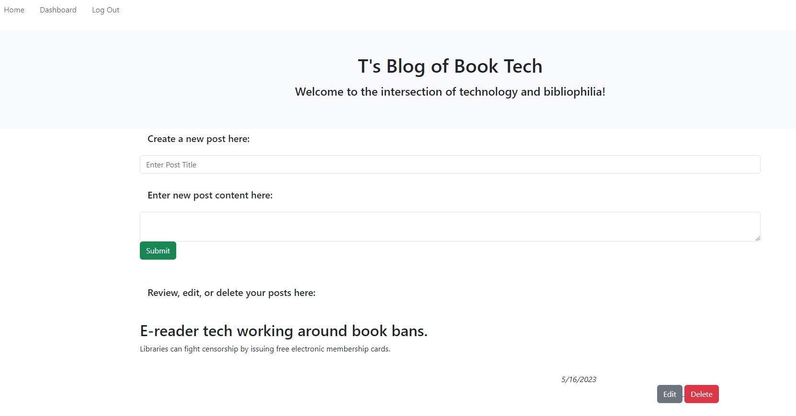
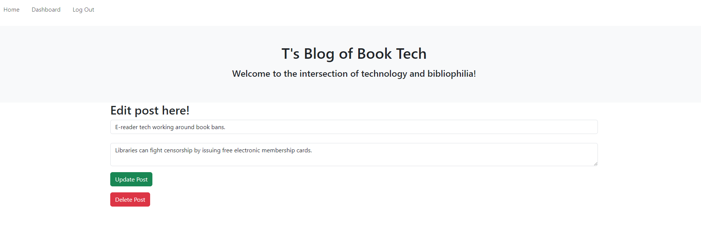

# MVC-Tech-Blog

## Description 

T's Blog of Book Tech is a website that celebrates the intersection of books and tech. When a user visits the site they will see posts that other users have made as well as comments that have been left on those posts.

A user can create an account allowing them to create, edit, and delete their own posts.

The account also allows users to comment on other posts.

---------------------------------------------------------------------------------------------------------------------------------------------

[Check out the site live here!](https://t-mvc-tech-blog.herokuapp.com/)

-------------------------------------------------------------------------------------------------------------------------------------------------------------------------------------------

If you have found this blog outside of GitHub and wish to view the original, [visit my Repository link here.](https://github.com/tdusenbury/MVC-Tech-Blog)

-------------------------------------------------------------------------------------------------------------------------------------------------------------------------------------------

The below image shows that when the site loads, you are presented with a homepage that includes a view of posted blog content; navigation links to the homepage and dashboard; and options to signup or login to a personal account.

-------------------------------------------------------------------------------------------------------------------------------------------------------------------------------------------

## Technology Used 

|  

-------------------------------------------------------------------------------------------------------------------------------------------------------------------------------------------

## Table of Contents

  - [**Description**](#description)
  - [**Usage**](#usage)
  - [**Author Info**](#author-info)
  - [**License**](#license)

-------------------------------------------------------------------------------------------------------------------------------------------------------------------------------------------
## Usage 

This application allows like-minded users to read and write about the effects of technology on books and vice versa. This CMS-style blog presents a sleek UI that is easy to use and guide yourself through.
*************
When a user needs to login, they are directed here:

****************
Once logged in, a user can visit their personal dashboard. This allows them easy access to create new content, view their previous posts, and edit or delete previous posts:

*****************
If a user chooses to edit or a delete one of their posts, they are directed to this screen:

-------------------------------------------------------------------------------------------------------------------------------------------------------------------------------------------

## Author Info
My name is Tamara "T" Dusenbury
If you have any questions about me or this project, please contact me:
  
- [**Github**](https://github.com/tdusenbury)

- [**LinkedIn**](https://linkedin.com/in/tamara-dusenbury-02ab8591)

- [**Email**](mailto:tamara.dusenbury@gmail.com)

-------------------------------------------------------------------------------------------------------------------------------------------------------------------------------------------
## Credits

I could only be so fortunate to work with such amazing people as those in my cohort!

-------------------------------------------------------------------------------------------------------------------------------------------------------------------------------------------

## Contributing

If you would like to contribute, please follow the [Contributor Covenant](https://www.contributor-covenant.org/).

-------------------------------------------------------------------------------------------------------------------------------------------------------------------------------------------

## License

This projects holds an MIT License.